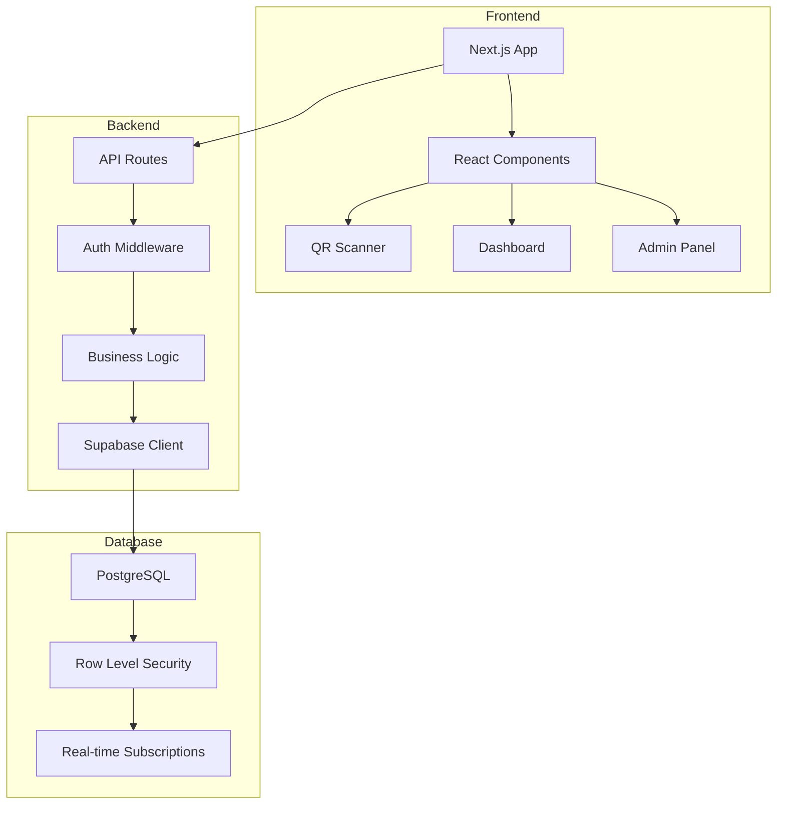

# 뉴욕러브베이글 통합 관리 시스템 - 프로젝트 인덱스

## 📋 목차
1. [프로젝트 개요](#프로젝트-개요)
2. [시스템 아키텍처](#시스템-아키텍처)
3. [주요 기능](#주요-기능)
4. [기술 스택](#기술-스택)
5. [프로젝트 구조](#프로젝트-구조)
6. [API 문서](#api-문서)
7. [데이터베이스 스키마](#데이터베이스-스키마)
8. [설치 및 실행](#설치-및-실행)
9. [개발 가이드](#개발-가이드)

---

## 프로젝트 개요

뉴욕러브베이글 통합 관리 시스템은 베이글 매장의 전반적인 운영을 디지털화하고 효율화하는 종합 관리 솔루션입니다.

### 핵심 가치
- **효율성**: QR 코드 기반 빠른 출퇴근 체크
- **투명성**: 실시간 근태 및 매출 모니터링
- **확장성**: 다중 매장 관리 지원
- **보안성**: 역할 기반 접근 제어 (RBAC)

---

## 시스템 아키텍처



### 계층 구조
1. **Presentation Layer**: Next.js, React, Tailwind CSS
2. **Business Logic Layer**: API Routes, 권한 관리
3. **Data Access Layer**: Supabase Client
4. **Database Layer**: PostgreSQL with RLS

---

## 주요 기능

### 1. 🔐 인증 및 권한 관리
- **계층적 권한 구조**
  - `super_admin`: 전체 시스템 관리
  - `admin`: 지역 관리
  - `manager`: 매장 관리
  - `employee`: 일반 직원
  - `part_time`: 파트타임 직원

### 2. 📱 QR 코드 시스템
- **동적 QR 코드**: 30초마다 자동 갱신
- **TOTP 기반 보안**: 시간 기반 일회용 비밀번호
- **위치 검증**: GPS 기반 출퇴근 위치 확인

### 3. ⏰ 근태 관리
- **실시간 출퇴근**: QR 스캔으로 즉시 기록
- **근무 시간 계산**: 자동 근무시간 및 초과근무 계산
- **출근 현황 대시보드**: 실시간 모니터링

### 4. 💰 매출 관리
- **일일 매출 기록**: 제품별 판매 기록
- **매출 분석**: 기간별, 제품별 매출 통계
- **재고 연동**: 판매와 재고 자동 연계

### 5. 👥 직원 관리
- **직원 등록 프로세스**: 이메일 인증 → 관리자 승인
- **문서 관리**: 신분증, 건강증명서 등 보관
- **급여 정보**: 시급, 은행 계좌 관리

---

## 기술 스택

### Frontend
- **Framework**: Next.js 14 (App Router)
- **Language**: TypeScript
- **Styling**: Tailwind CSS
- **UI Components**: shadcn/ui
- **State Management**: React Hooks
- **QR Libraries**: 
  - `react-qr-code`: QR 코드 생성
  - `qr-scanner`: QR 코드 스캔

### Backend
- **Runtime**: Node.js
- **API**: Next.js Route Handlers
- **Database**: Supabase (PostgreSQL)
- **Authentication**: Supabase Auth
- **Security**: 
  - TOTP (Time-based One-Time Password)
  - AES-256 암호화
  - HMAC-SHA256 서명

### DevOps
- **Hosting**: Vercel
- **Database**: Supabase Cloud
- **Version Control**: Git
- **Package Manager**: npm

### Infrastructure
- **Error Handling**: 중앙집중식 에러 처리 시스템
- **Logging**: 구조화된 로깅 시스템
- **Security**: Rate limiting, CORS, 보안 헤더
- **Monitoring**: Correlation ID 기반 추적

---

## 프로젝트 구조

```
bagel-shop/
├── app/                        # Next.js App Router
│   ├── (auth)/                # 인증 레이아웃
│   │   ├── login/            # 로그인 페이지
│   │   └── signup/           # 회원가입 페이지
│   │       └── employee/     # 직원 회원가입
│   ├── (dashboard)/          # 대시보드 레이아웃
│   │   ├── dashboard/        # 메인 대시보드
│   │   └── admin/            # 관리자 페이지
│   │       └── stores/       # 매장 관리
│   ├── api/                  # API 라우트
│   │   ├── auth/            # 인증 API
│   │   ├── qr/              # QR 관련 API
│   │   └── admin/           # 관리자 API
│   └── demo/                # 데모 페이지
├── components/               # React 컴포넌트
│   ├── auth/                # 인증 컴포넌트
│   ├── qr/                  # QR 컴포넌트
│   ├── layouts/             # 레이아웃 컴포넌트
│   └── ui/                  # UI 컴포넌트
├── lib/                     # 유틸리티 함수
│   ├── api/                # API 응답 표준화
│   ├── auth/               # 인증 헬퍼
│   ├── errors/             # 에러 처리 시스템
│   ├── logging/            # 로깅 시스템
│   ├── security/           # 보안 미들웨어
│   ├── seed/               # 시드 데이터
│   ├── supabase/           # Supabase 클라이언트
│   └── utils/              # 기타 유틸리티
├── supabase/               # 데이터베이스
│   └── migrations/         # SQL 마이그레이션
├── types/                  # TypeScript 타입 정의
└── docs/                   # 문서

```

---

## API 문서

### 인증 API

#### POST `/api/auth/signup/employee`
직원 회원가입 요청 생성
```json
{
  "email": "employee@example.com",
  "fullName": "홍길동",
  "phone": "010-1234-5678",
  "storeCode": "GANGNAM001"
}
```

#### POST `/api/auth/signup/employee/verify`
이메일 인증 코드 확인
```json
{
  "requestId": "uuid",
  "verificationCode": "123456"
}
```

### QR 코드 API

#### POST `/api/qr/generate`
매장 QR 코드 생성 (관리자 전용)
```json
{
  "storeId": "uuid"
}
```

#### POST `/api/qr/checkin`
QR 코드로 출퇴근 체크
```json
{
  "qrData": "encrypted-qr-data",
  "location": {
    "latitude": 37.123456,
    "longitude": 127.123456,
    "accuracy": 10
  }
}
```

### 관리자 API

#### GET `/api/admin/signup-requests`
직원 가입 요청 목록 조회
- Query Parameters:
  - `status`: pending | verified | approved | rejected
  - `storeId`: 특정 매장 필터링

#### POST `/api/admin/signup-requests/[id]/approve`
직원 가입 승인
```json
{
  "role": "employee"
}
```

#### POST `/api/admin/signup-requests/[id]/reject`
직원 가입 거절
```json
{
  "reason": "거절 사유"
}
```

---

## 데이터베이스 스키마

### 주요 테이블

#### `profiles`
사용자 프로필 정보
- `id` (UUID): 사용자 ID
- `email` (TEXT): 이메일
- `full_name` (TEXT): 이름
- `role` (TEXT): 권한
- `phone` (TEXT): 전화번호

#### `stores`
매장 정보
- `id` (UUID): 매장 ID
- `name` (TEXT): 매장명
- `code` (TEXT): 매장 코드
- `qr_secret` (TEXT): QR 시크릿
- `location_lat/lng` (DECIMAL): 위치 좌표

#### `employees`
직원 정보
- `id` (UUID): 직원 ID
- `user_id` (UUID): 사용자 ID
- `store_id` (UUID): 소속 매장
- `qr_code` (TEXT): 개인 QR 코드
- `hourly_wage` (DECIMAL): 시급

#### `attendance_records`
출퇴근 기록
- `id` (UUID): 기록 ID
- `employee_id` (UUID): 직원 ID
- `check_in_time` (TIMESTAMPTZ): 출근 시간
- `check_out_time` (TIMESTAMPTZ): 퇴근 시간
- `work_date` (DATE): 근무일

#### `qr_tokens`
QR 토큰 관리
- `id` (UUID): 토큰 ID
- `store_id` (UUID): 매장 ID
- `token_hash` (TEXT): 토큰 해시
- `valid_until` (TIMESTAMPTZ): 유효기간

### Row Level Security (RLS)
모든 테이블에 역할 기반 접근 제어 적용:
- 사용자는 자신의 데이터만 조회 가능
- 관리자는 권한 범위 내 데이터 조회/수정 가능
- Super Admin은 모든 데이터 접근 가능

---

## 설치 및 실행

### 사전 요구사항
- Node.js 18+
- npm 또는 yarn
- Supabase 계정

### 설치 단계

1. **저장소 클론**
```bash
git clone [repository-url]
cd bagel-shop
```

2. **의존성 설치**
```bash
npm install
```

3. **환경 변수 설정**
`.env.local` 파일 생성:
```env
NEXT_PUBLIC_SUPABASE_URL=your-supabase-url
NEXT_PUBLIC_SUPABASE_ANON_KEY=your-anon-key
```

4. **데이터베이스 마이그레이션**
Supabase 대시보드에서 SQL 마이그레이션 실행

5. **개발 서버 실행**
```bash
npm run dev
```

---

## 개발 가이드

### 코드 컨벤션
- **TypeScript**: 엄격한 타입 체크 사용
- **컴포넌트**: 함수형 컴포넌트 사용
- **스타일링**: Tailwind CSS 유틸리티 클래스
- **네이밍**: camelCase (변수), PascalCase (컴포넌트)

### Git 워크플로우
1. Feature 브랜치 생성: `feature/기능명`
2. 커밋 메시지: `feat:`, `fix:`, `docs:` 등 prefix 사용
3. Pull Request 생성 및 코드 리뷰
4. Main 브랜치로 머지

### 테스트
- 단위 테스트: Jest
- E2E 테스트: Playwright
- 테스트 커버리지 목표: 80%

### 보안 가이드라인
- 민감한 정보는 환경 변수 사용
- SQL Injection 방지: Parameterized queries
- XSS 방지: 사용자 입력 검증
- CSRF 보호: Supabase 내장 보호 기능

---

## 문서 참조

- [프로젝트 개요](./README.md)
- [개발 진행 로그](./DEVELOPMENT_LOG.md)
- [로드맵](./ROADMAP.md)
- [설정 가이드](./SETUP_GUIDE.md)
- [테스트 가이드](./TEST_GUIDE.md)
- [에러 핸들링 시스템 가이드](./docs/ERROR_HANDLING.md)
- [QR 로그인 시스템 설계](./docs/QR_LOGIN_SYSTEM_DESIGN.md)
- [PRD 문서](./PRD_베이글샵_통합관리시스템.md)

---

*최종 업데이트: 2025년 7월 27일*